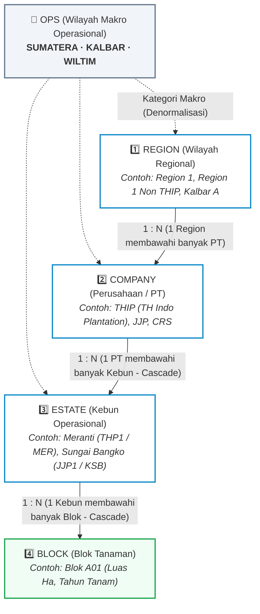

# LOCATION_HIERARCHY.md — Struktur Hierarki Wilayah & Lokasi Operasional

Dokumen ini menjelaskan struktur data dan relasi hierarki lokasi perkebunan dari tingkat makro operasional (**`ops`**), regional (**`Region`**), perusahaan PT (**`Company`**), kebun operasional (**`Estate`**), hingga petak tanaman (**`Block`**) yang aktif di sistem **WM PRJCT MNGMNT**.

---

## 1. Diagram Relasi Hierarki



---

## 2. Penjelasan Tingkatan Entitas

| Level | Entitas | Tipe / Model Prisma | Keterangan & Peran Bisnis | Contoh Data Riil (Live Neon) |
|---|---|---|---|---|
| **Makro** | **`ops`** | String (`text`) | Pengelompokan wilayah operasional makro perkebunan. Disimpan secara denormalisasi di `Region`, `Company`, dan `Estate` untuk memudahkan penyaringan data tingkat eksekutif. | `SUMATERA`<br>`KALBAR`<br>`WILTIM` |
| **Level 1** | **`Region`** | Model `Region` | Unit koordinasi regional. Membawahi beberapa perusahaan PT (`1 : N`). Memiliki nomor urut (`order`) untuk susunan dropdown di antarmuka pengguna. | • `Region 1` (`ops: SUMATERA`, `order: 1`)<br>• `Region 1 Non THIP`<br>• `Kalbar A` (`ops: KALBAR`) |
| **Level 2** | **`Company`** | Model `Company` | Entitas legal PT pemilik kebun dan proyek. Kode uniknya (`code`) menjadi **dasar penomoran kode proyek atomik** (`WM-{COMPANY}-{YYYY}-{SEQ4}`). Memiliki nama alias operasional (`alias`). | • `THIP` (PT TH Indo Plantation)<br>• `JJP` (PT Jatim Jaya Perkasa)<br>• `CRS` (PT Citra Riau Sarana) |
| **Level 3** | **`Estate`** | Model `Estate` | Unit kebun operasional lapangan tempat pekerjaan fisik/proyek tata air dilaksanakan. Mencatat kode ganda: kode format baru (`estateNew`), kode warisan/lama (`legacyCode`), dan grup kebun (`group`). | • `Meranti` (`THP1` / `MER`, Group: THIP 1)<br>• `Sungai Bangko` (`JJP1` / `KSB`, Group: Sumatera 1)<br>• `Teso` (`CRS` / `KSO`, Group: Sumatera 2) |
| **Level 4** | **`Block`** | Model `Block` | Petak blok tanaman kelapa sawit fisik terkecil dalam kebun. Mencatat tahun tanam (`plantingYear`) dan luas area dalam hektar (`areaHectares`). | • Blok A01 (Luas: 28.5 Ha, TT: 2011)<br>• Blok B04 (Luas: 30.0 Ha, TT: 2015) |

---

## 3. Skema Data & Relasi Foreign Key

```prisma
model Region {
  id        String    @id @default(cuid())
  code      String    @unique
  name      String
  ops       String?   // SUMATERA, KALBAR, WILTIM
  order     Int       @default(0)
  isActive  Boolean   @default(true)
  companies Company[]
}

model Company {
  id       String    @id @default(cuid())
  code     String    @unique
  name     String
  alias    String?
  ops      String?
  order    Int       @default(0)
  isActive Boolean   @default(true)
  regionId String?
  region   Region?   @relation(fields: [regionId], references: [id], onDelete: SetNull)
  estates  Estate[]
  projects Project[]
}

model Estate {
  id         String    @id @default(cuid())
  companyId  String
  code       String
  name       String
  ops        String?
  region     String?
  group      String?
  estateNew  String?   // Format baru: THP1..THP20, JJP1
  legacyCode String?   // Format warisan: KSB, KSR, KDP, MER
  order      Int       @default(0)
  isActive   Boolean   @default(true)
  company    Company   @relation(fields: [companyId], references: [id], onDelete: Cascade)
  blocks     Block[]
  projects   Project[]

  @@unique([companyId, code])
}

model Block {
  id           String    @id @default(cuid())
  estateId     String
  blockCode    String
  name         String
  plantingYear Int?
  areaHectares Float?
  isActive     Boolean   @default(true)
  estate       Estate    @relation(fields: [estateId], references: [id], onDelete: Cascade)
  projects     Project[]

  @@unique([estateId, blockCode])
}
```

---

## 4. Alur Integrasi pada Sistem

### A. Form Inisiasi Proyek Baru (`/projects/new`)
- Pengguna memilih lokasi dengan mekanisme **seleksi berantai (*cascading select*)**:
  1. Pilih **Region** $\rightarrow$ API mengambil daftar Company pada region tersebut (`/api/master?type=company&regionId=...`).
  2. Pilih **Company** $\rightarrow$ API mengambil daftar Estate pada perusahaan tersebut (`/api/master?type=estate&companyId=...`).
  3. Pilih **Estate** $\rightarrow$ API mengambil daftar Blok pada estate tersebut (`/api/master?type=block&estateId=...`).
- **Validasi Integritas**: `companyId` dan `estateId` wajib terisi pada tabel `Project` (FK `Restrict`), sedangkan `blockId` bersifat opsional (FK `SetNull`) untuk proyek yang mencakup seluruh kebun/saluran primer lintas-blok.

### B. Filter Multi-Select pada Halaman Laporan (`/reports`)
- Header filter laporan mendukung pemilihan perusahaan multi-select (`companyIds`) yang dikelompokkan berdasarkan **Region** dan **OPS**, memungkinkan manajemen melihat rekapitulasi performa per wilayah makro (misalnya seluruh PT di wilayah Sumatera).
